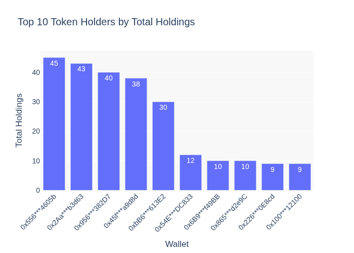

# Znapshot
The automated snapshot taker using Caldera/Blockscout API and GitHub workflow 

You can find a good-looking version of the leaderboard [here](https://leaderboard.agentzerro.com/).

## 📊 Token Statistics (Auto-Generated)

Here is a quick snapshot of the current token statistics and top holders.

1. Raw Tokens File: [Tokens.json](Tokens.json)
2. Raw Leaderboard File: [Total.json](Total.json)
3. Raw Statistics File: [Statistics.json](Statistics.json)

---

### 📈 Top 10 Token Holders

#### 🔢 Top 10 Holders Table

| Rank | Address | Total Holdings |
|------|---------|----------------|
| 1 | [0x505***e3faE](https://explorer.zero.network/address/0x505216f954D09B868115B29F48cEabf5393e3faE) | 83 |
| 2 | [0xE28***f07C2](https://explorer.zero.network/address/0xE28033a9BD54202d5f2487dd2C8518F48f4f07C2) | 64 |
| 3 | [0x733***517d4](https://explorer.zero.network/address/0x733F6AEbf69D1B80B5B88859240cA155D50517d4) | 60 |
| 4 | [0x61e***0042E](https://explorer.zero.network/address/0x61e75a8583e5eCF2A6018b138D98Bfb64F30042E) | 51 |
| 5 | [0xAB1***3c91B](https://explorer.zero.network/address/0xAB13211F8ACCA2Cdad9fBB06E97d8b936a83c91B) | 40 |
| 6 | [0x132***aA8d1](https://explorer.zero.network/address/0x132289F7788099b07C1D12a6bFF0a79e6d8aA8d1) | 26 |
| 7 | [0x556***4605b](https://explorer.zero.network/address/0x5564Caa789AD35E72b1612D1Bf78dD295b24605b) | 22 |
| 8 | [0x81c***3BcC5](https://explorer.zero.network/address/0x81cF8aed4CD8eAD1a80cFf195f0162BE5b43BcC5) | 19 |
| 9 | [0x1aE***806aa](https://explorer.zero.network/address/0x1aE1F53F5006E3fb336a6d7E54c1c45aa55806aa) | 19 |
| 10 | [0xB10***ac206](https://explorer.zero.network/address/0xB1062c554120b8A0834fE03FfE14eDB9bD8ac206) | 15 |

---

### 📋 Detailed Statistics

| Token | Total Holders | Total Tokens Held | Average Tokens | Max Tokens | Min Tokens |
|-------|----------------|--------------------|----------------|-------------|-------------|
| [ZERROS1E1](https://highlight.xyz/mint/zero:0x87470544d0009cde93891a073822c03a6930f876:1) | 3799 | 3912 | 1.03 | 10 | 1 |
| [ZERROS1E2](https://highlight.xyz/mint/zero:0x572C9543574f581E6B1c0ac979B0bec2D094847A:1) | 5696 | 5808 | 1.02 | 10 | 1 |
| [ZERROS1E3](https://highlight.xyz/mint/zero:0x82Bc1E1706B8270e299E9AcEaE3d6BEE894780a1:1) | 5688 | 5840 | 1.03 | 10 | 1 |
| [ZERROS1E4](https://highlight.xyz/mint/zero:0x6def074f62A00c5FD466bCa3076d336A89BB4077:1) | 4089 | 4193 | 1.03 | 10 | 1 |
| [ZERROS1E5](https://highlight.xyz/mint/zero:0x306C4056a9e784E1B4Ce926a399Bf9ea72C1438D:1) | 3421 | 3523 | 1.03 | 10 | 1 |
| [ZERROS1E6](https://highlight.xyz/mint/zero:0x746627343D01376A599853143C2608617e027A8f:1) | 2079 | 2140 | 1.03 | 11 | 1 |
| [ZERROS1E7](https://highlight.xyz/mint/zero:0xc07d2E465b3661C07aDEe383f689112383e2f94d:1) | 2239 | 2294 | 1.02 | 10 | 1 |
| [ZERROS1E8](https://highlight.xyz/mint/zero:0x95ACc120760180ABC43123af0114Be544FcbD7f1:1) | 1747 | 1767 | 1.01 | 11 | 1 |
| [ZERROS1E9](https://highlight.xyz/mint/zero:0x5be47Faa559104A33B53bCb426Ab2f3C42e4374c:1) | 1573 | 1586 | 1.01 | 2 | 1 |

---

Hope you enjoy it!
Made with ❤️

---
